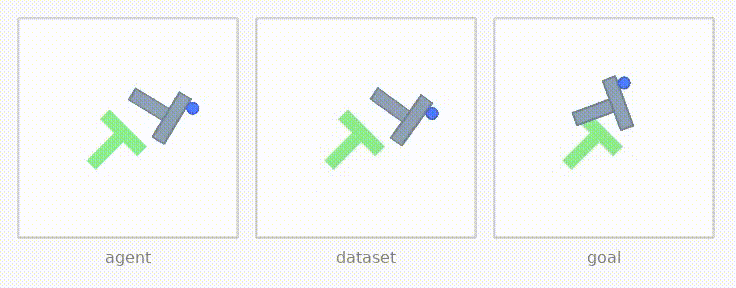
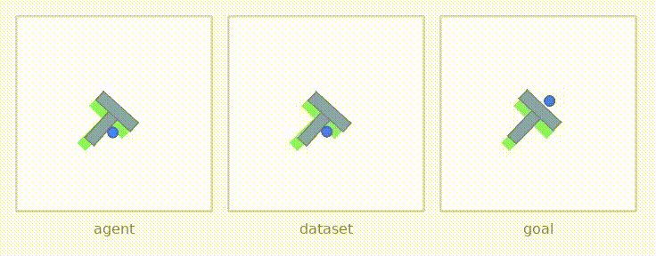
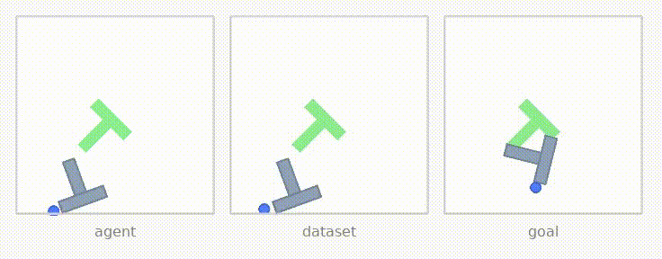
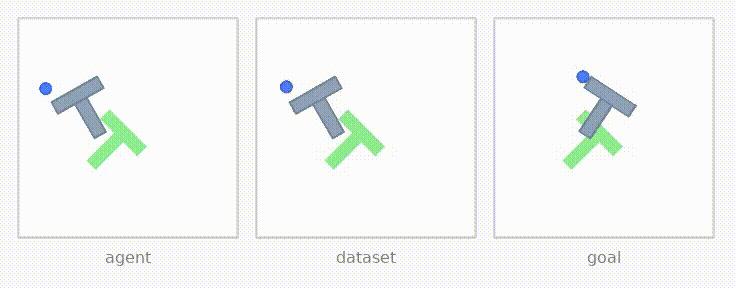
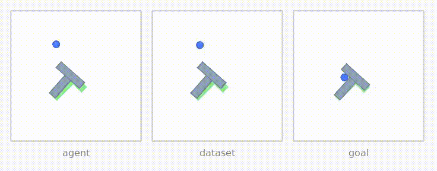
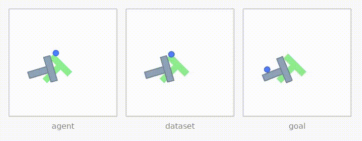
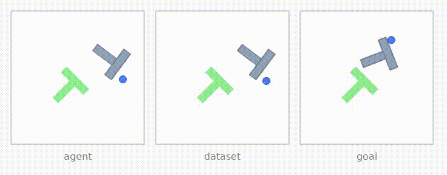
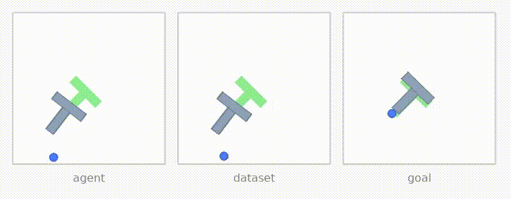
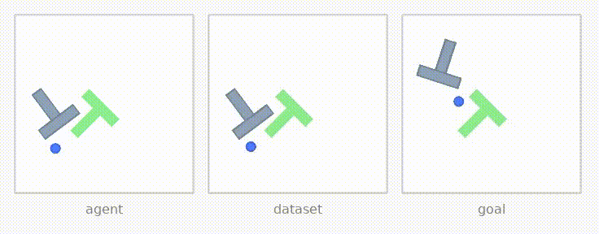
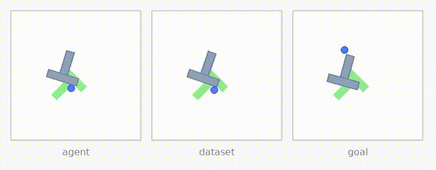

# Summary 26/09/08

## Overview

1. LeWorldModel相关实验
2. 其他paper及设想

## LeWorldModel

### 1. Horizon Ablation

#### **Key Parameters:** 

| frameskip (action block) | action input dim | horizon | receding horizon | Solver |
|-------|--------|-------|-------|----|
| 5 (default) | 10 (default) | 3 | 3 | CEM (default) |
| 5 (default) | 10 (default) | 4 | 4 | CEM (default) |
| 5 (default) | 10 (default) | 5 (default) | 5 (default) | CEM (default) |
| 5 (default) | 10 (default) | 6 | 6 | CEM (default) |
| 5 (default) | 10 (default) | 7 | 7 | CEM (default) |
| 5 (default) | 10 (default) | 8 | 8 | CEM (default) |
| 5 (default) | 10 (default) | 9 | 9 | CEM (default) |
| 5 (default) | 10 (default) | 10 | 10 | CEM (default) |

#### **Evaluation Results**
```mermaid
xychart
    title "Planning Accuracy"
    x-axis "Horizon" ["3", "4", "5 (default)", "6", "7", "8", "9", "10"]
    y-axis "Accuracy" 0.35 --> 1
    line [0.96 "0.96", 0.96 "0.96", 0.92 "0.92", 0.74 "0.74", 0.62 "0.62", 0.60 "0.60", 0.54 "0.54", 0.40 "0.40"]
```

### 2. Larger Action Block

#### **Key Parameters & Results**
| frameskip (action block) | action input embed_dim | horizon | receding horizon | Solver | Accuracy |
|-------|--------|-------|-------|----|------|
| 40 | 80 | 1 | 1 | CEM (default) | 0.04 |
| 5 (default) | 10 (default) | 8 | 8 | CEM (default) | 0.60 |

### 3. Examples

#### **Success Examples**

**1. ActionBlock = 5, horizon = 5** \


**2. ActionBlock = 5, horizon = 8** \



#### **Failure Examples**

**1. ActionBlock = 5, horizon = 5** \


**2. ActionBlock = 5, horizon = 8** \





**3. ActionBlock = 40, horizon = 1** \




#### **Analysis**

**1. 误差累积导致大horizon效果差**

**2. horizon大，CEM采样空间大**

**3. 原LeWM改大action block效果不佳**

#### **Features**

**1. 未必得到最优解**

**2. long-horizon planning前期模型易迷茫，在起点周围探索**

**3. 有正确趋势**

## Papers
- [Fast LeWM](https://arxiv.org/abs/2606.26217)
- [GC-IDM](https://arxiv.org/abs/2605.08732): 及时观察，及时矫正
- [LeFlow](https://arxiv.org/abs/2608.24855): 全局规划
- [Traj-LeWM](https://arxiv.org/abs/2608.14125): 全局评估
