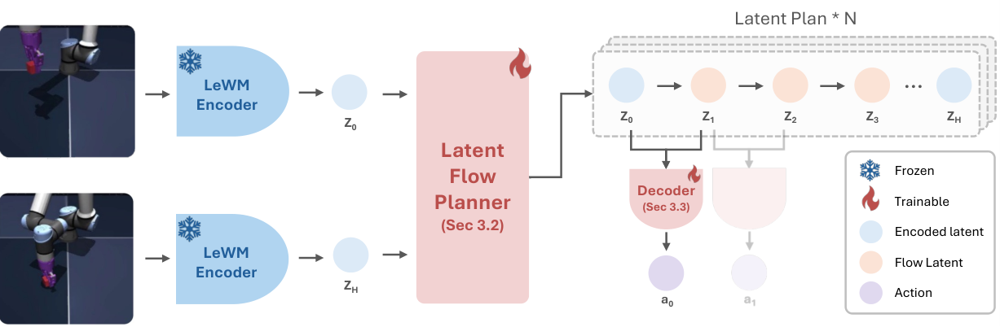
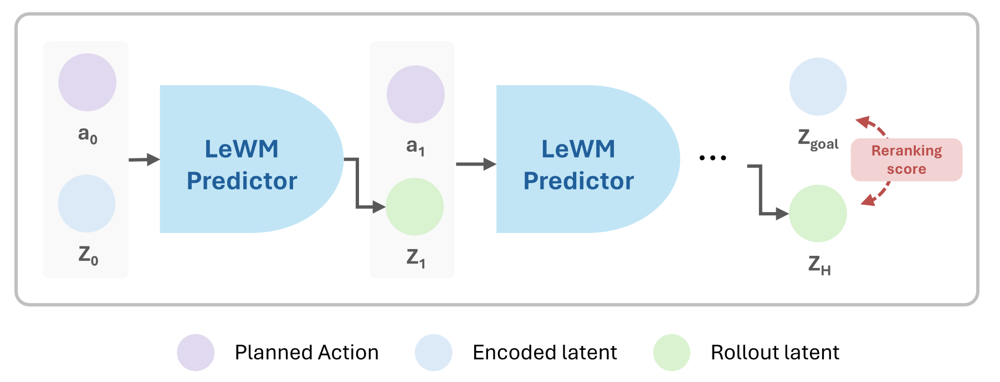
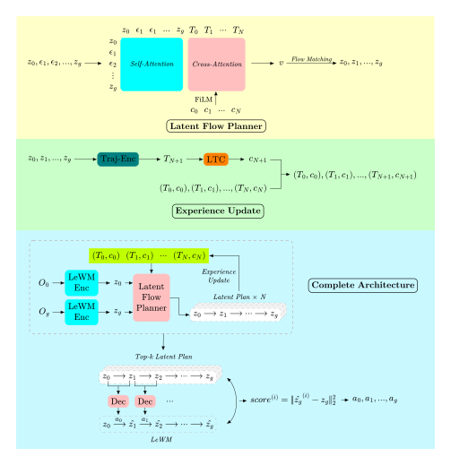
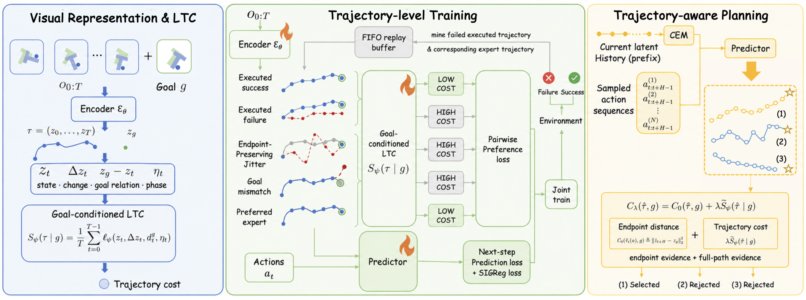
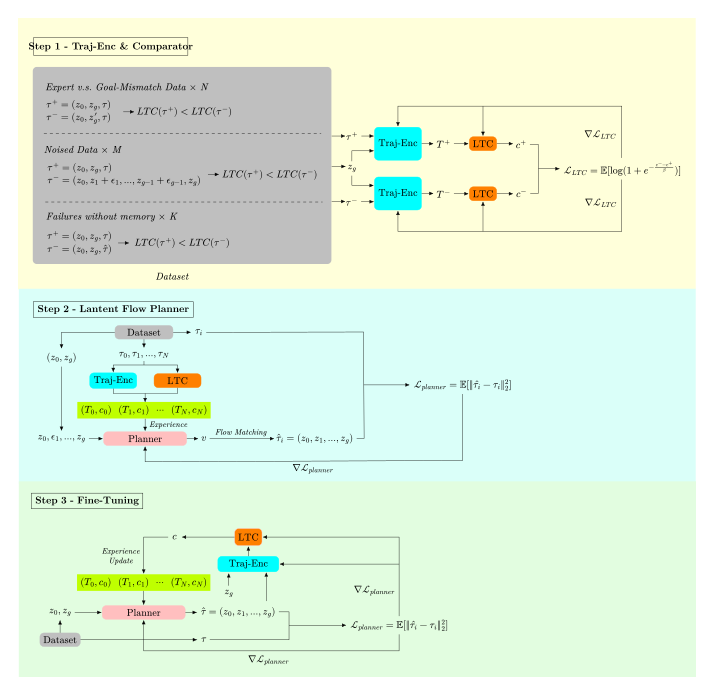

# Summary 26/09/15

## Overview

**1. LeFlow**

**2. Architecture design**

**3. Training design**

## LeFlow

|training horizon|horizon|receding horizon|goal offset steps|budget|accuracy|
|----|----|----|-----|-----|------|
|5|5|5|25|50|0.98|
|5|5|5|50|50|0.66|
|5|5|5|100|100|0.14|
|5|10|10|50|50|0.22|
|5|10|10|100|100|0.06|
|5|10|5|100|100|0.06|
|5|10|10|25|50|0.74|
|10|10|10|25|50|0.64|
|10|10|10|25|100|0.82|
|10|10|10|50|50|0.70|
|10|10|10|100|100|0.24|
|10|10|5|100|100|0.10|
|10|10|5|25|50|0.16|
|10|10|5|25|100|0.30|

**1. Planning horizon**


**2. Long task**


**3. Budget**


**4. Receding horizon (replanning)**


**5. Training matters**


## Architecture design

### [LeFlow](https://arxiv.org/abs/2608.24855)




### LeFlow + Experiences



#### **1. Latent Flow Planner**

LeFlow Planner (transformer + flow matching) + experience cross-attention + score FiLM

#### **2. Experience update**

- Trajectory encoder: transformer

- LTC: MLP

- Planner: transformer flow matching

#### **3. Complete architecture**

```
def planner(O_0, O_g, N, K, plan_max)
    # ---------- input ----------
    # O_0 : current observation
    # O_g : goal observation
    # N   : number of plans for each loop
    # K   : Top-k plans for final evaluation
    # plan_max: Maximum number of planning cycles

    # ---------- output ----------
    # actions : action sequence

    # ============================================================
    # Step 1: Encoding
    # ============================================================
    z_0  = LeWM_Enc(O_0)
    z_g  = LeWM_Enc(O_g)

    # ============================================================
    # Step 2: Latent Flow Planner
    # ============================================================
    experiences = []

    for j in range(plan_max) :
        latent_plans = []
        for i in range(N):
            plan_i = LatentFlowPlanner(z_0, z_g, experiences)
            latent_plans.append(plan_i)

        # ============================================================
        # Step 3: Experience Update
        # ============================================================
        trajectories = [traj_enc(p) for p in latent_plans]
        for p in latent_plans:
            traj = Traj_Enc(p)
            c = LTC(traj)
            experiences.appent((traj, c))
            top_k_plans = updateTopKPlans(top_k_plans, K, p, c)

    # ============================================================
    # Step 4: Final evaluation & selection
    # ============================================================
    best_plan  = None
    best_score = inf

    for plan in top_k_plans:
        actions = []
        for i in range(len(plan) - 1):
            actions.append(Action_Decoder(plan[i], plan[i+1]))
        z_g_hat = LeWM(z_0, actions)
        score = scorer(z_g_hat)
        if score < best_score:
            best_score = score
            best_plan = actions

    return actions
```

## Training design

### [Traj-LeWM](https://arxiv.org/abs/2608.14125)



#### Dataset design

1. Expert vs goal mismatching

2. Expert vs noised intermediate path

3. Expert vs failure

### Training design


