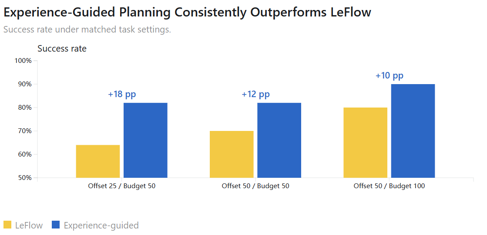
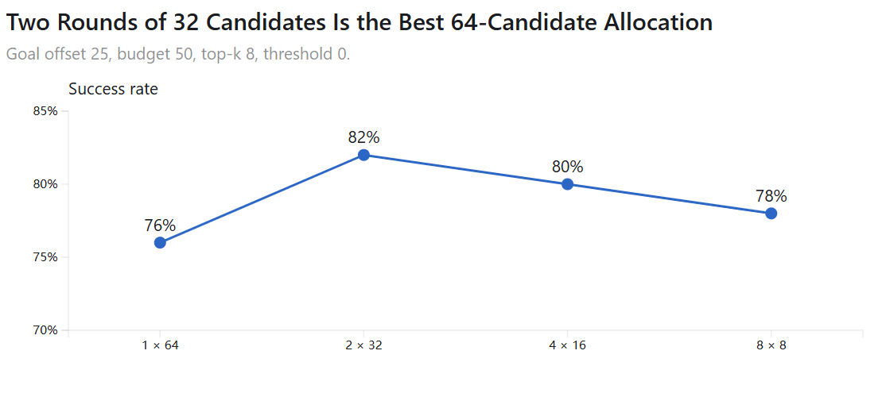
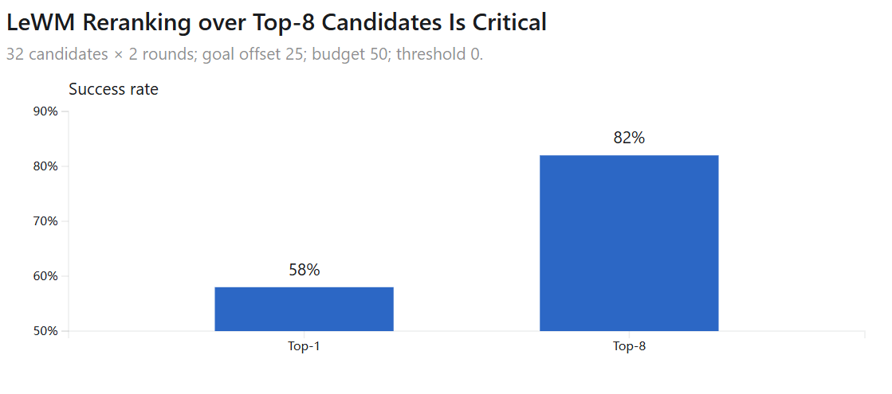
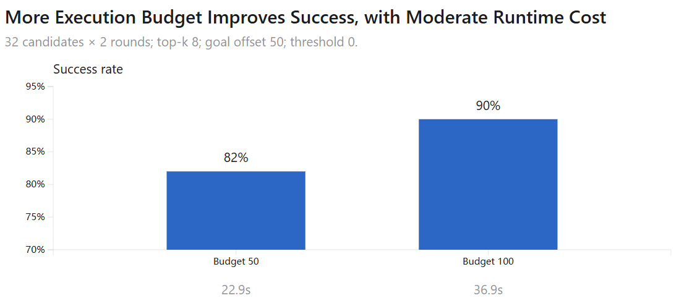
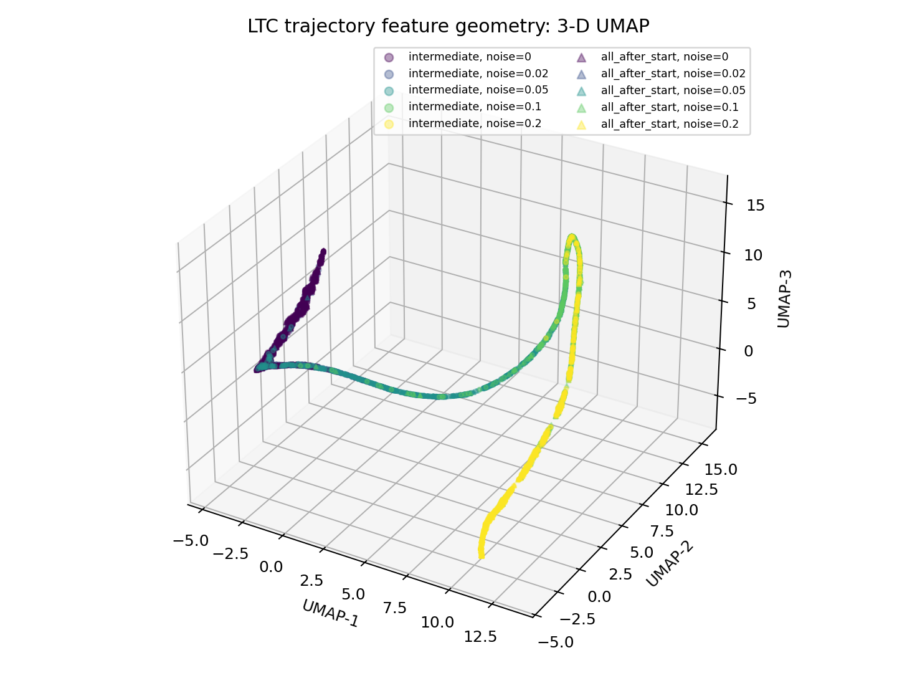
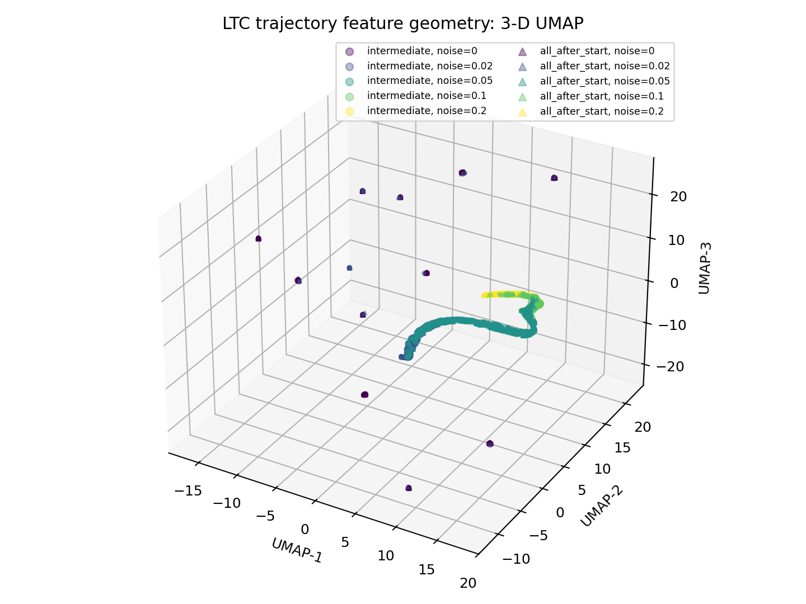
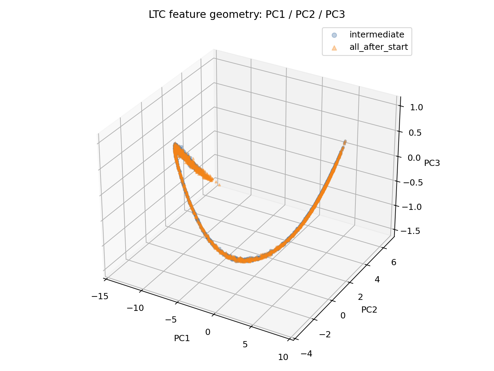
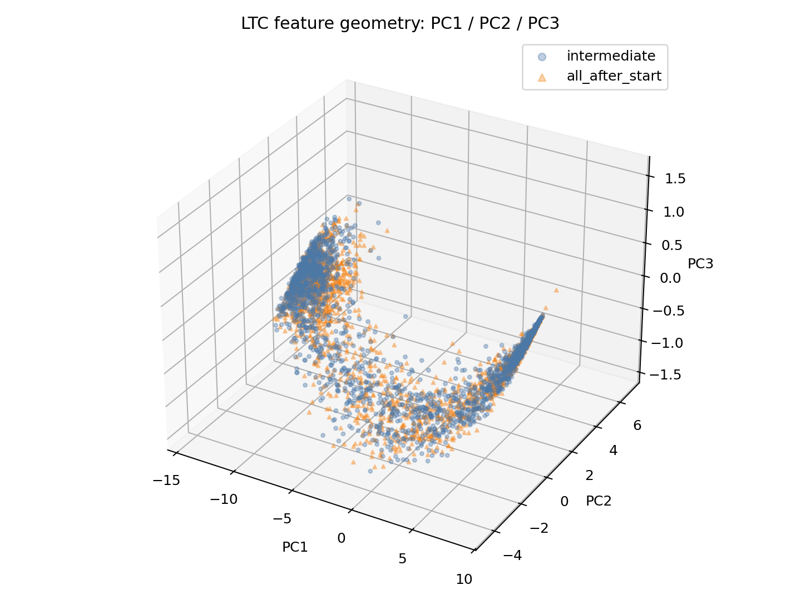

# 26/09/22

## Overview

**1. Implement LeFlow with experience**

**2. Training**

**3. Evaluation**

**4. Analysis**

## Implement LeFlow with experience

### Model Parameters

**1. Flow Planner (18.18M):**

- dim latent 192, hidden dim 512

- 4 layers transformer, 8 heads

- FFN: 512, 2048, 512; dropout 0

- max horizon 20, training horizon 10

- experience dim 256, hidden dim 512

- cost FiLM: 1 -> 512 -> 1024 (shift, scale) -> V of experience

- self-attention cross attention no mask

**2. Trajectory Encoder (4.49M):**

- max path length 21

- input dim 384 ([$z_t, z_g - z_t$]), hidden 256

- goal condition: 192 -> 256 -> 256, SiLU, AdaLN

- 4 layers transformer, 8 heads, dropout 0.1

- output feature 256

**3. Cost Model (99k):**

- MLP: 256 -> 256 -> 128 -> 1

**4. Inverse Dynamics (0.83M):**

- from LeFlow

- MLP: 576 -> 512 -> 512 -> 512 -> 10

**5. LeWM Encoder**

- frozen

## Training

### Training Configs

**1. [LTC Training](https://wandb.ai/ahiruneko47-hong-kong-baptist-university/lewm-latent-trajectory-cost/runs/z65celwc?nw=nwuserahiruneko47)**

- model: cost model, traj enc

- loss: $\mathcal{L}=\text{Softplus}(-\frac{c^--c^+}{\beta})$

- batch size 128, 10 epoch, lr 1e-4, no scheduler, weight decay 1e-4, grad clip 1.0

- using best val model: epoch 4 model

**2. [Planner training](https://wandb.ai/ahiruneko47-hong-kong-baptist-university/lewm-latent-planner/runs/p9ql75r6?nw=nwuserahiruneko47)**

- model: planner, cost model (frozen), traj enc (frozen)

- data: 50% after start noisy, 50% between start and goal noisy

- max experience 64, flow rollout steps 16

- batch size 128, 10 epoch, lr 1e-4, weight decay 1e-4, grad clip 1.0

**3. [Fine-tuning](https://wandb.ai/ahiruneko47-hong-kong-baptist-university/lewm-latent-planner-finetune/runs/w5plkb1b?nw=nwuserahiruneko47)**

- model: planner, cost model, traj enc

- 4 candidates * 16 rounds, FIFO

- LTC data: 8 real rollout (sorted) + expert vs noisy

- 1 epoch, max 5000 steps, lr 1e-5, encoder lr le-6, cost lr 1e-6, weight decay 1e-4, grad clip 1.0

## Evaluation

| Goal offset | Budget | candidates × rounds | Top-k | cost threshold | accuracy | time | accuracy increase | time increase |
|---:|---:|---:|---:|---:|---:|---:|---:|---:|
| 25 | 50 | 4 × 16 | 1 | 0 | 58% | 21.2 s | -6 pp | -17.3 s |
| 25 | 50 | 4 × 16 | 1 | -3 | 64% | 73.0 s | +0 pp | +34.5 s |
| 25 | 50 | 8 × 8 | 8 | 0 | 78% | 19.2 s | +14 pp | -19.3 s |
| 25 | 50 | 16 × 4 | 8 | 0 | 80% | 20.5 s | +16 pp | -18 s |
| 25 | 50 | 32 × 2 | 8 | 0 | **82%** | 20.3 s | +18 pp | -18.2 s |
| 25 | 50 | 64 × 1 | 8 | 0 | 76% | 22.9 s | +12 pp | -15.6 s |
| 25 | 50 | 32 × 2 | 1 | 0 | 58% | 21.7 s | -6 pp | -16.8 s |
| 50 | 50 | 32 × 2 | 8 | 0 | **82%** | 22.9 s | +12 pp | +1.4 s |
| 50 | 50 | 64 × 1 | 8 | 0 | 80% | 21.9 s | +10 pp | +0.4 pp |
| 50 | 100 | 32 × 2 | 8 | 0 | **90%** | 36.9 s | +10 pp | +0 s |

**Baselines (LeFlow)**
| Training horizon | Goal offset | Budget | accuracy | time |
|---:|---:|---:|---:|---:|
|10|25|50|64%|38.5 s|
|10|50|50|70%|21.5 s|
|10|50|100|80%|36.9 s|

## Analysis

**1. Improvements**

**2. Candidates x rounds**

**3. Top-k**

**4. Budget**

### Accuracy

### Trajectory Feature Space

**1. UMAP**

**2. PCA**

PC1: 93.8%

PC1 + PC2: 99.5%

effective rank: 1.29

expert-centered effective rank: 1.30

### Future Improvements

1. SIGReg for traj-enc

2. Early-stop conditon

3. Training

4. LTC comparison

5. Real trajectory fine-tuning