# 26/09/28

## Overview

## 2-Phase Training + SIGReg + experience loss + Sigmoid

76%

## SIGReg + std input + experience loss

max 88%

## SIGReg + std input + experience loss + cost fine-tuning expert trajectory alignment

max 88%

using plan algorithm similar to GC-IDM: 90%

## Candidate Comparison

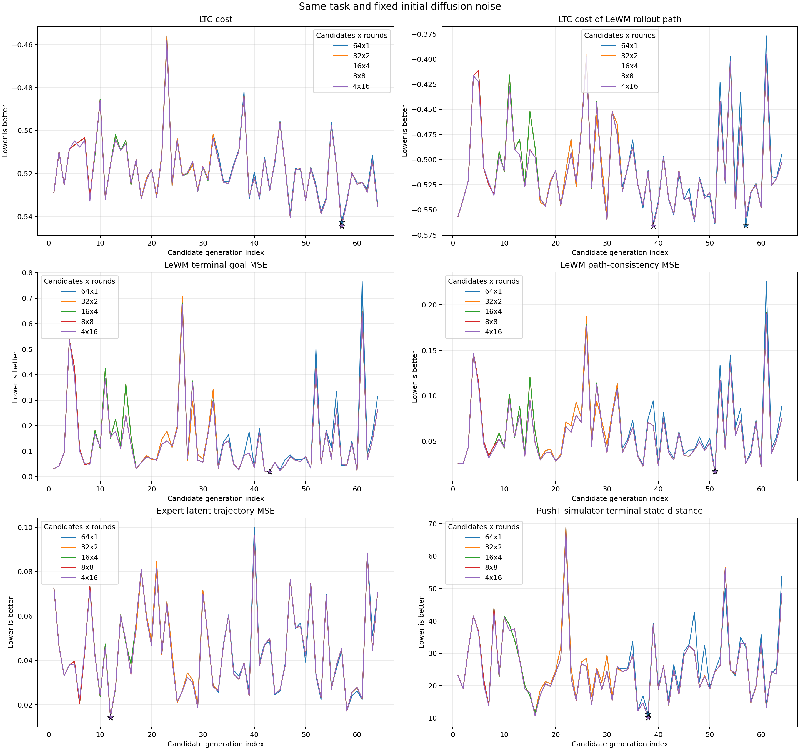
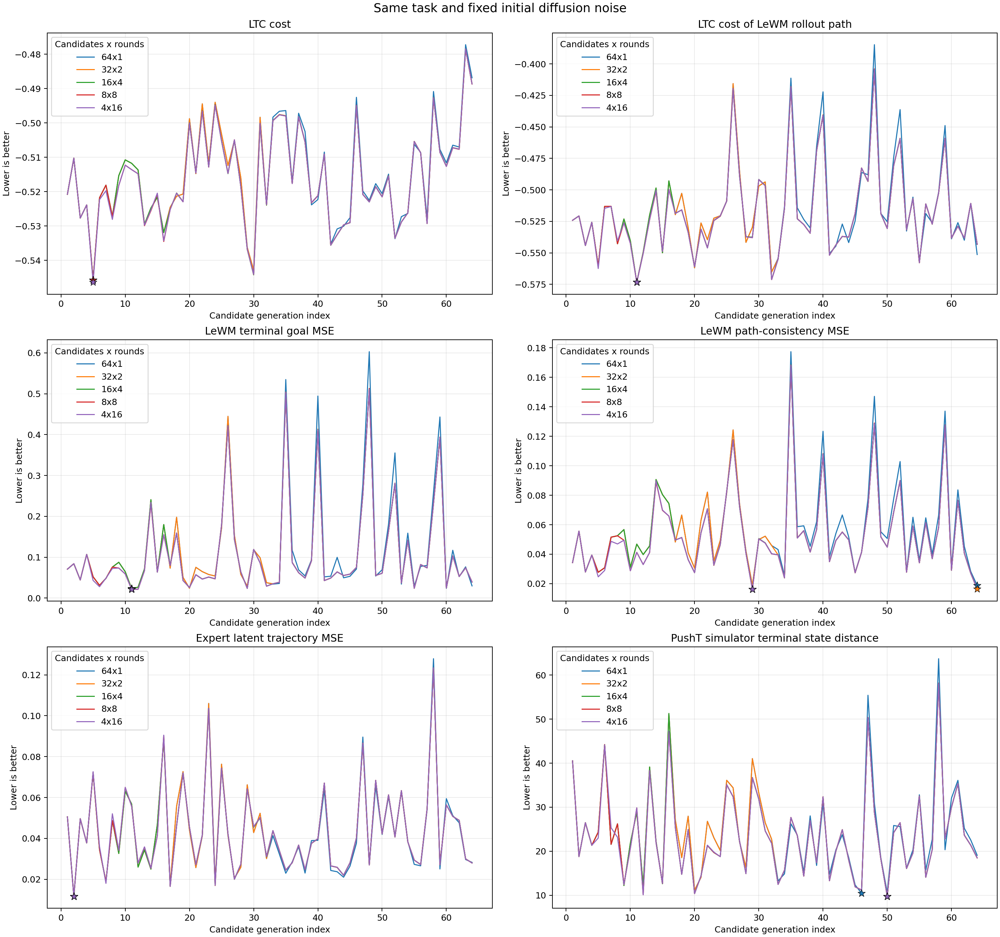

| Run | `64×1` simulator mean | `4×16` simulator mean | Best simulator distance |
|---|---:|---:|---:|
| 171622 | 28.21 | 27.42 | 9.28 → 7.75 |
| 171902 | 24.80 | 23.83 | 10.44 → 9.76 |

| Run | Expert-path Spearman | Selected trajectory simulator rank |
|---|---:|---:|
| 171622 | 0.33–0.35 | `12–14 / 64` |
| 171902 | 0.24–0.32 | `20–22 / 64` |

## Component Error

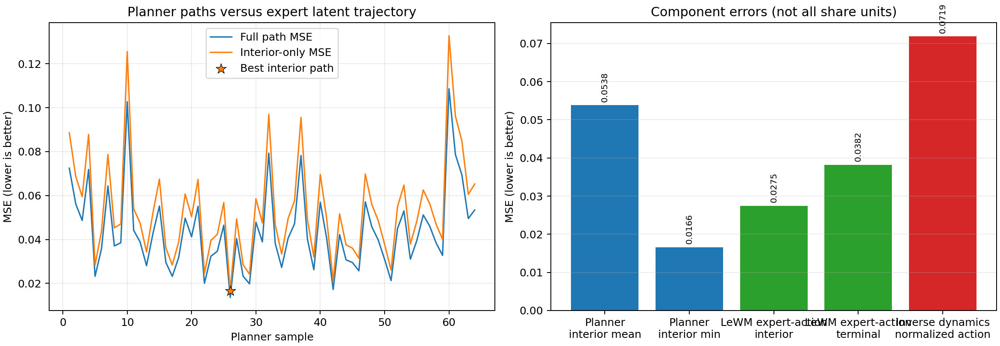

## Rollout Trajectory

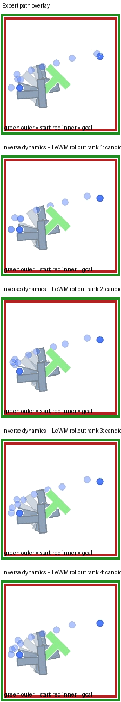
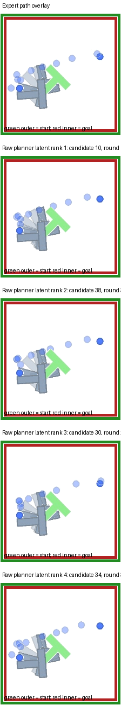
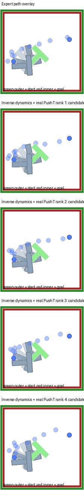

## Cross Attention

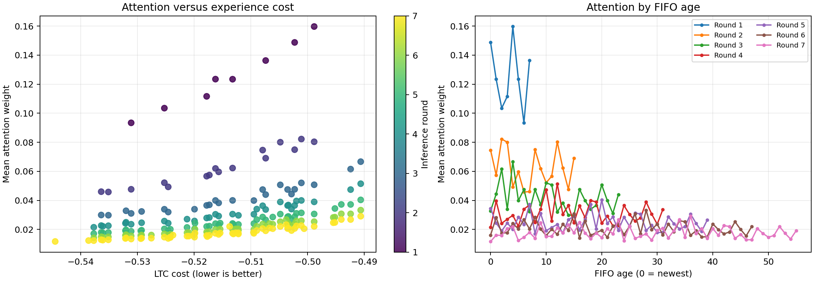
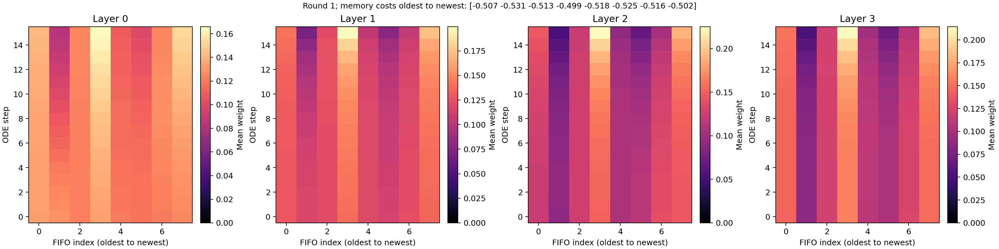
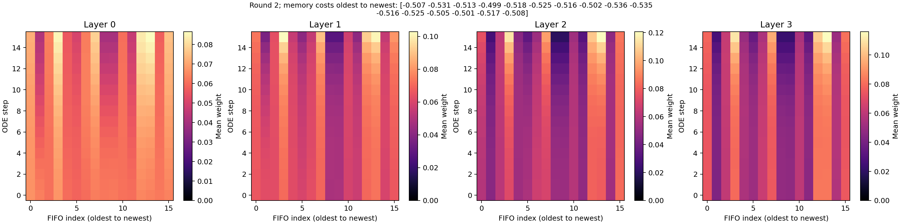
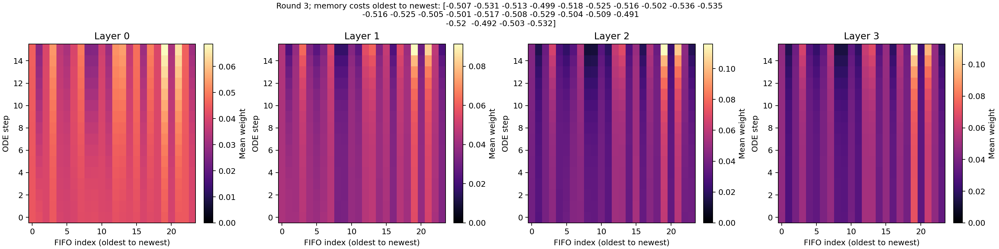
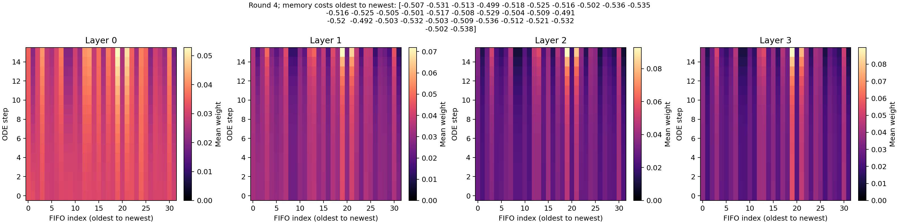
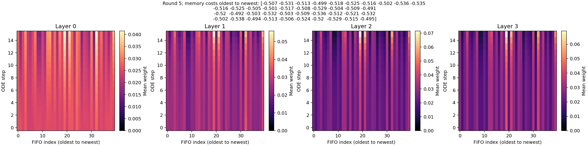
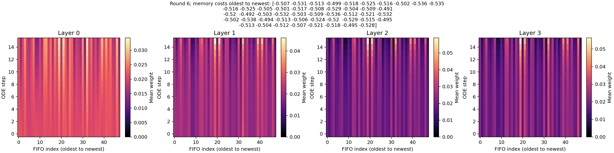
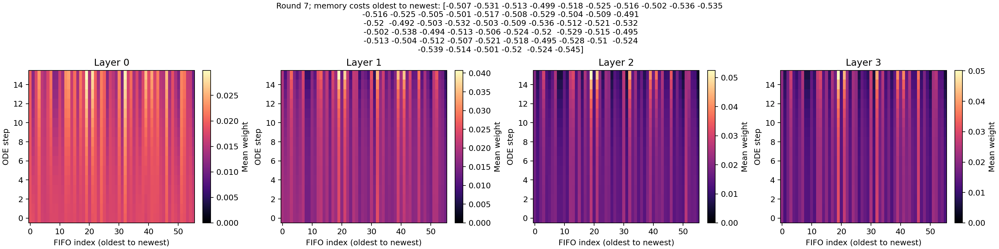