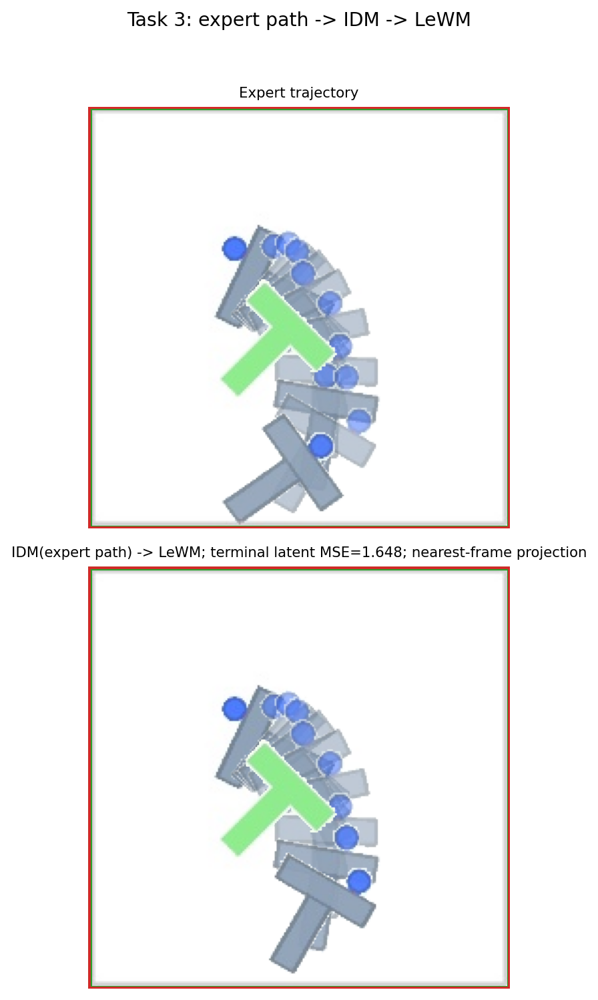
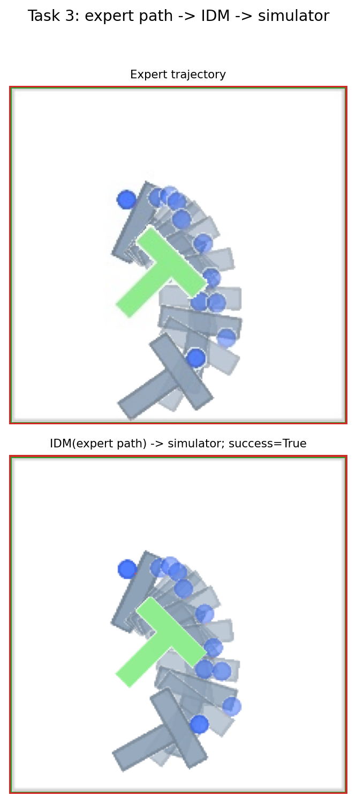
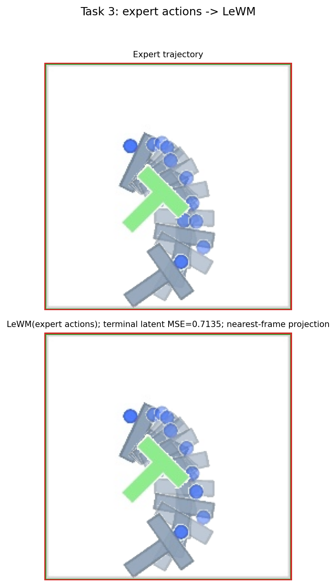
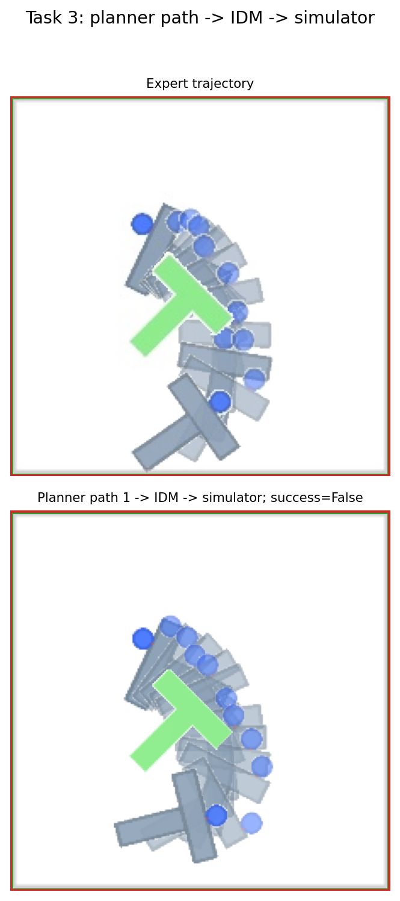
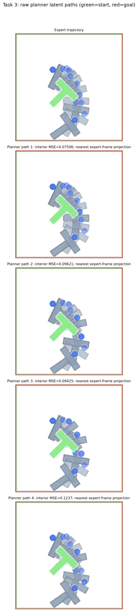

# 26/10/07

## Overview

**1. SIGReg**

**2. Analysis**

**3. Evaluation (Solver)**

## Experience LeFlow + SIGReg

SIGReg weight: 1e-4

max accuracy: 88% (32 candidates x 2 rounds, top 8)

## Inference Chain Analysis

### Original LeFlow

1. expert path idm to lewm

2. idm expert to simulator

3. lewm expert actions

4. planner idm to simulator

5. planner paths

### Experience LeFlow

1. expert path idm to lewm

2. idm expert to simulator

3. lewm expert actions

4. planner idm to simulator

5. planner paths

### Summary

| methods | original | experience | increase |
|---|---:|---:|---:|
| Expert path → IDM → simulator success | 88% | **96%** | **+8 pp** |
| Planner path 1 → IDM → simulator success | 66% | **74%** | **+8 pp** |
| Planner first MSE | 0.0705 | **0.0646** | -8.3% |
| planner average MSE | 0.0779 | 0.0781 | almost no change |
| planner best MSE | 0.0510 | **0.0491** | a little |
| Expert action → LeWM terminal MSE | 0.1991 | 0.1991 | same |
| Expert path → IDM → LeWM terminal MSE | 0.2035 | 0.2024 | almost no change |

**Conclusion**

1. experience has better IDM

2. experience planner better but limited

3. LeWM brings errors

4. planner paths seems reasonable

## Segmented Evaluation (original LeFlow)

action block = 5

for each segmentation ($z_t$ to $z_{t+5}$):

$$
e_t = \|\text{LeWM}(z_t, \text{IDM}(z_T, z_{t+5})) - z_{t+5}\|_2^2
$$

whole path score:

$$
S_{seg} = \sum_{t=0}^{H-1}\frac{\gamma^t}{\sum_{j=0}^{H-1}\gamma^j}e_t
$$

$\gamma$ = segment_decay

highest accuracy ($\gamma=0.95$, $\gamma=0.96$, segment size: 1 horizon): 92%

three seeds: 92%, 90%, 80% -> $87.3\% \pm 6.4\%$

segment size 1, 2, 5 horizon: 92%, 84%, 80%

low horizon (horizon = receding horizon = 5, goal_offset_steps = 25, budget = 50): max accuracy 94% (original 98%)